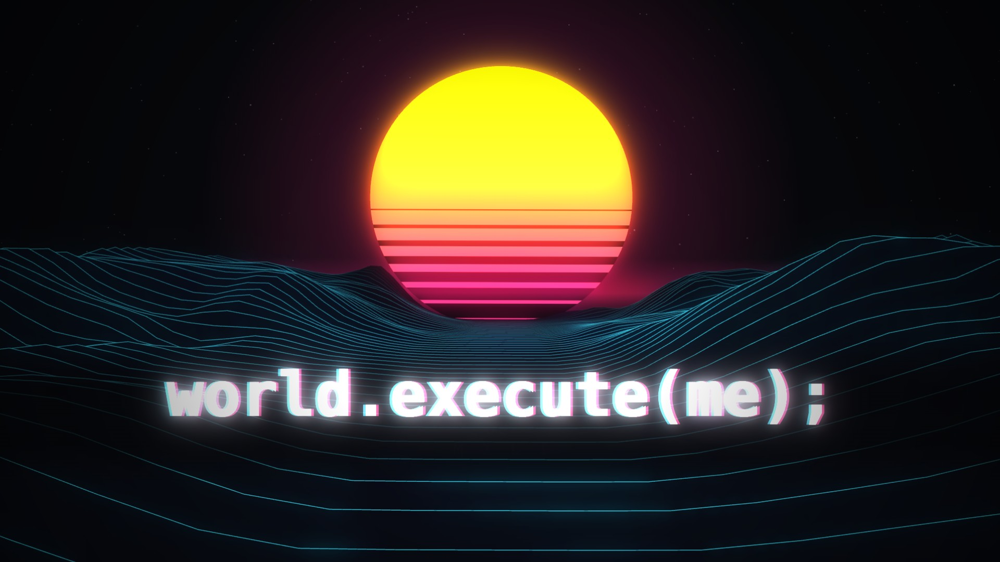

# world.execute(me); MV 配套代码

这是 B 站视频 [【Opus5.5 一句话生成 world.execute(me); mv （附对话过程记录）】](https://www.bilibili.com/video/BV1RHhU63ESq/) 的配套网页源码。[动态壁纸版本已上传 Wallpaper Engine 创意工坊](https://steamcommunity.com/sharedfiles/filedetails/?id=3808989186)。

## 使用

用 `index.html` 创建 Wallpaper Engine 网页壁纸。仓库不包含音乐：在本地项目目录放入自己的 `song.mp3`，或在浏览器中点“选择本地音乐”。`song.mp3` 已被 Git 忽略。

中英歌词默认开启；Claude 对话动画默认关闭，可用页面左下角的开关或壁纸属性切换。浏览器地址加 `?claude=1` 可默认显示动画，加 `?lyrics=0` 可隐藏歌词。

## 许可

程序代码采用 [MIT License](LICENSE)。音乐、歌词、截图及第三方品牌素材不在 MIT 授权范围内；原曲及英文歌词归 Mili 等相应权利方所有。
